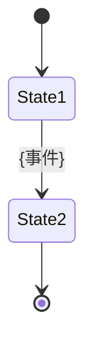
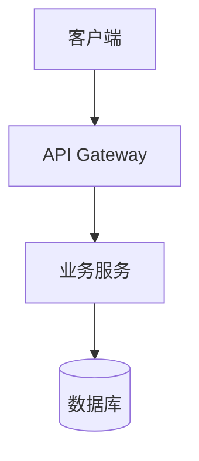

# 开发完工报告模板

> 本文件由 prd-reverse-writer 技能在生成报告时加载。
> 根据工作模式（A 有 PRD / B 无 PRD），选择性使用对应章节。

---

# {产品名} 开发完工报告

## 文档信息

| 字段 | 内容 |
|------|------|
| 产品名称 | {产品名} |
| 功能模块 | {模块名} |
| 报告版本 | v1.0 |
| 生成日期 | {YYYY-MM-DD} |
| 工作模式 | {A — PRD 反写 / B — 无 PRD 补录} |
| 开发周期 | {首次提交日期} ~ {最后提交日期}，共 {N} 天 |
| 技术栈 | 前端: {} / 后端: {} / 数据库: {} |
| 代码仓库 | {路径} |
| 原 PRD | {路径 或 "无"} |
| 总提交数 | {N} 次（feat: {} / fix: {} / refactor: {} / other: {}） |
| 功能模块数 | {N} 个 |

<!-- 模式 A 额外字段 -->
| PRD 功能需求数 | {N} 条（编号 F-001 ~ F-{NNN}） |
| 完全实现 | {N} 条（） |
| 未实现 | {N} 条（{%}） |
| 新增实现（PRD 外） | {N} 条 |

---

## 一、报告概览

{1-2 段文字总结：开发了什么、整体完成度如何、最大的变更点是什么}

---

## 二、功能实现总览

<!-- 模式 A：覆盖矩阵 -->

| PRD 编号 | 功能名称 | 优先级 | 实现状态 | 代码入口 | 变更说明 |
|---------|---------|--------|---------|---------|---------|
| F-001 | {名称} | P0 | ✅已实现 | {文件路径} | — |
| F-002 | {名称} | P0 | ⚠️部分实现 | {文件路径} | {简述差异} |
| F-003 | {名称} | P1 | ❌未实现 | — | {未实现原因} |
| — | {名称} | — | 🆕新增 | {文件路径} | 开发中新增，PRD 未覆盖 |

<!-- 模式 B：功能地图 -->

| 模块编号 | 模块名称 | 页面数 | 接口数 | 核心能力概述 | 代码入口 |
|---------|---------|-------|-------|-------------|---------|
| M-001 | {名称} | {N} | {N} | {一句话} | {路径} |

---

## 三、功能模块详述

### 3.{N} {模块名称}

#### 模块定位

{一段话说明这个模块做什么、在系统中的角色}

#### 页面与路由

| 路由路径 | 页面组件 | 功能描述 | 权限要求 |
|---------|---------|---------|---------|
| /path | ComponentName | {功能} | {权限或"无"} |

#### 核心组件

| 组件名 | 文件路径 | 功能描述 | Props 概要 |
|--------|---------|---------|-----------|
| {Name} | {path} | {功能} | {关键 props} |

#### 业务规则

从代码中提取的实际业务逻辑：

1. **{规则名}**：{用自然语言描述，附代码依据}
2. **{规则名}**：{...}

#### 状态流转

{如有状态机，用 Mermaid stateDiagram 描述}



#### 数据模型

| 表名/集合名 | 字段 | 类型 | 约束 | 说明 |
|------------|------|------|------|------|
| {table} | {field} | {type} | NOT NULL, UNIQUE | {说明} |

关联关系：{描述表之间的关系}

#### API 接口

| 方法 | 路径 | 功能 | 鉴权 |
|------|------|------|------|
| GET | /api/xxx | {功能} | {方式} |

**{接口名} 详情**

- 请求参数：

| 字段 | 类型 | 必填 | 说明 |
|------|------|------|------|
| {field} | {type} | 是/否 | {说明} |

- 响应示例：

```json
{
  "code": 200,
  "data": {}
}
```

- 错误码：

| 错误码 | 含义 | 触发条件 |
|--------|------|---------|
| {code} | {含义} | {条件} |

<!-- 模式 A 额外段落 -->
#### 与 PRD 的差异

| PRD 编号 | PRD 描述 | 实际实现 | 差异类型 | 推断原因 |
|---------|---------|---------|---------|---------|
| F-xxx-xx | {PRD 原文} | {实际实现} | 砍掉/降级/新增/偏离/技术调整 | {原因或"未知"} |

---

## 四、技术方案沉淀

### 4.1 系统架构

{文字描述系统整体架构}



### 4.2 核心技术选型

| 领域 | 技术 | 版本 | 推断用途 |
|------|------|------|---------|
| 前端框架 | {name} | {ver} | {用途} |
| 后端框架 | {name} | {ver} | {用途} |
| 数据库 | {name} | {ver} | {用途} |
| 缓存 | {name} | {ver} | {用途} |

### 4.3 第三方服务依赖

| 服务 | 用途 | 接入方式 | 配置文件 |
|------|------|---------|---------|
| {name} | {用途} | SDK / API | {路径} |

### 4.4 性能与安全配置

| 配置项 | 实际值 | 代码位置 | PRD 要求值（模式 A） |
|--------|--------|---------|-------------------|
| 接口超时 | {ms} | {路径} | {PRD 值或"—"} |
| 缓存 TTL | {s} | {路径} | {PRD 值或"—"} |
| 并发限制 | {N} | {路径} | {PRD 值或"—"} |

### 4.5 特性开关

| 开关名 | 用途 | 默认值 | 配置位置 |
|--------|------|--------|---------|
| {name} | {用途} | {true/false} | {路径} |

### 4.6 部署配置

| 配置项 | 值 | 来源文件 |
|--------|---|---------|
| 运行环境 | {值} | {文件} |
| 构建命令 | {值} | {文件} |
| 端口 | {值} | {文件} |

---

## 五、设计资产归档

### 5.1 色彩体系

| 角色 | HEX 色值 | RGB | 用途 | CSS 变量 / Tailwind 类名 |
|------|---------|-----|------|------------------------|
| Primary | #{hex} | {rgb} | {用途} | {变量名} |

### 5.2 字体层级

| 层级 | 字体族 | 桌面字号 | 移动字号 | 字重 | 行高 |
|------|--------|---------|---------|------|------|
| H1 | {font} | {px} | {px} | {weight} | {height} |

### 5.3 间距规范

| Token | 值 | 用途 | 来源 |
|-------|---|------|------|
| spacing-xs | {px} | {用途} | {文件} |

### 5.4 圆角与阴影

| 层级 | 圆角 | 阴影 | 用途 |
|------|------|------|------|
| sm | {px} | {value} | {用途} |

### 5.5 组件使用统计

| 组件 | 来源 | 使用次数 | 文件路径 |
|------|------|---------|---------|
| {Name} | 自定义 / {库名} | {N} | {path} |

### 5.6 图标清单

| 图标名 | 来源库 | 使用场景 | 使用次数 |
|--------|--------|---------|---------|
| {name} | {lib} | {场景} | {N} |

### 5.7 动效参数

| 场景 | 时长 | 缓动函数 | CSS 属性 | 代码位置 |
|------|------|---------|---------|---------|
| {场景} | {ms} | {easing} | {prop} | {path} |

---

## 六、变更决策记录

| 编号 | 决策事项 | 决策内容 | 推断来源 | 置信度 |
|------|---------|---------|---------|--------|
| D-001 | {事项} | {内容} | {commit/文件/注释} | 高/中/低 |

---

## 七、技术债与遗留项

### 7.1 代码标注（TODO / FIXME / HACK）

| 标记 | 内容 | 文件位置 | 行号 | 严重程度 |
|------|------|---------|------|---------|
| {TODO/FIXME/HACK} | {内容} | {path} | {line} | 高/中/低 |

### 7.2 变更热点

| 文件 | 修改次数 | 首次修改 | 最后修改 | 推断原因 |
|------|---------|---------|---------|---------|
| {path} | {N} | {date} | {date} | {原因} |

### 7.3 建议下一期处理

1. **{事项}**：{说明}（来源：{TODO编号/需求编号}）
2. **{事项}**：{说明}

---

## 八、附件清单

| 类型 | 文件路径 | 说明 |
|------|---------|------|
| 代码仓库 | {path} | 主仓库 |
| 原 PRD | {path} | 模式 A |
| Pipeline 产出 | {paths} | 如有 |
| 本报告 | {path} | |
